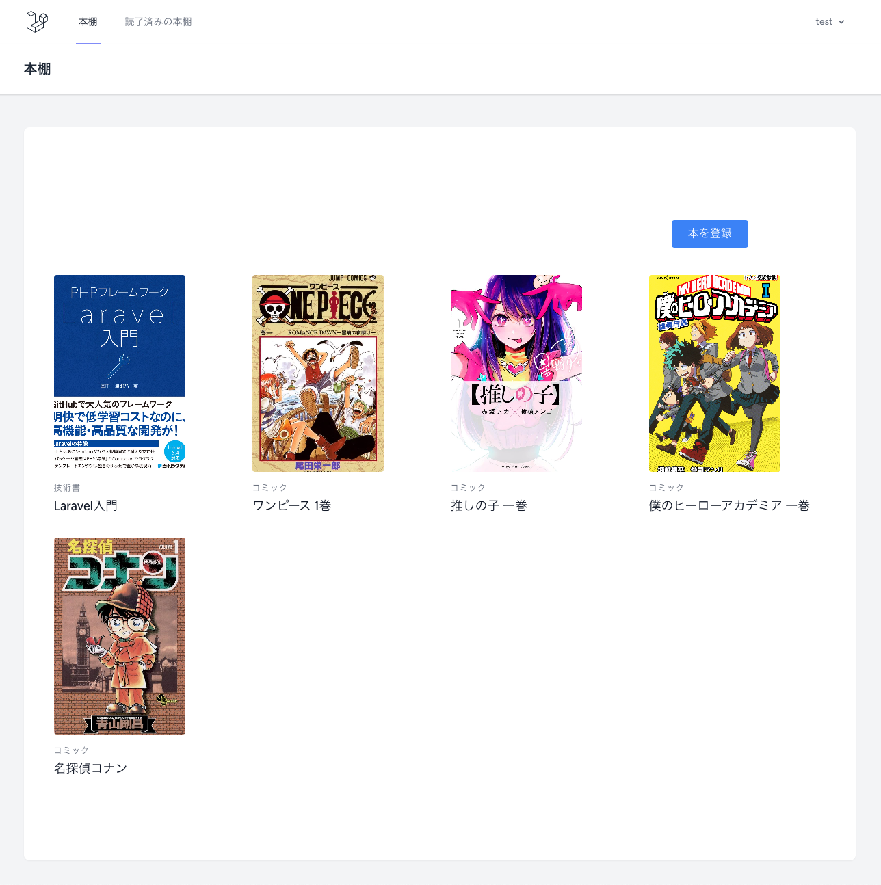

# 📚 Book管理アプリ / Book Management App

## 📝 概要 / Overview

このアプリは、Laravelを使って作成した学習用のBook管理アプリです。  
基本的なWeb開発の流れやツールの使い方を理解することを目的に開発しました。

> This app is a learning project built using Laravel.  
> It was created to understand the basic flow of web development and how to use essential tools.

---

## 🚀 学習したこと / What I Learned

- ✅ Laravelの基本的なCRUD（作成・表示・編集・削除）機能  
  > Basic CRUD operations with Laravel (Create, Read, Update, Delete)

- ✅ 画像アップロード機能  
  > Image upload functionality

- ✅ フラッシュメッセージの表示とデザイン  
  > Flash message display and styling

- ✅ 読了済みチェック機能と読了一覧表示  
  > Marking books as read and listing completed books

- ✅ バリデーションとエラーメッセージ表示  
  > Form validation and error message display

- ✅ Tailwind CSSによるスタイリング  
  > Styling using Tailwind CSS

- ✅ Gitによるバージョン管理とGitHub活用  
  > Version control with Git and using GitHub

---

## 🖥️ トップページ / Top Page

👤 作者 / Author
Shoma Inenaga

GitHub: @CodeByShoma

📄 ライセンス / License
このプロジェクトはMITライセンスのもとで公開されています。

This project is licensed under the MIT License.
